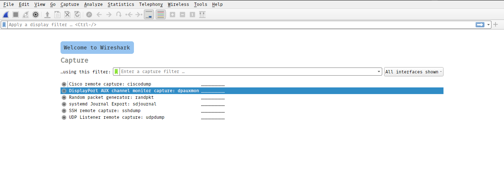
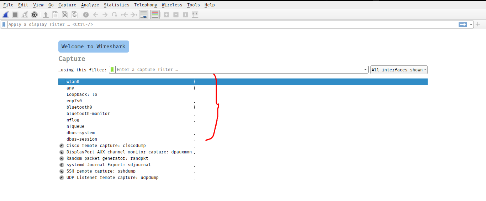

# Troubleshooting some problems

## Problem
----

### Wireshark not showing all the interfaces as 
 
---

                                                                    Wireshark 

## Solution
---
## [Wireshark ‘no interfaces found’ error explained](https://www.comparitech.com/net-admin/wireshark-no-interfaces-found-error-explained/)
---
    
## [How to fix Wireshark "Couldn’t run /usr/bin/dumpcap in child process: Permission denied" on Linux](https://techoverflow.net/2019/06/10/how-to-fix-wireshark-couldnt-run-usr-bin-dumpcap-in-child-process-permission-denied-on-linux/)
---

### wireshark does not need to run as root but dumpcap needs superuser network privileges If the code for Wireshark is in bin and not sbin, change “/usr/sbin/” to “/usr/bin/” in the above command
            sudo chown root /usr/sbin/dumpcap
            sudo chmod u+s /usr/sbin/dumpcap
### your current user doesn’t have permission to capture packets from your network card so to solve this probelm you need to add your current user in **_wireshark_** group
            sudo usermod -a -G wireshark $USER

                                                                    Problem solved

